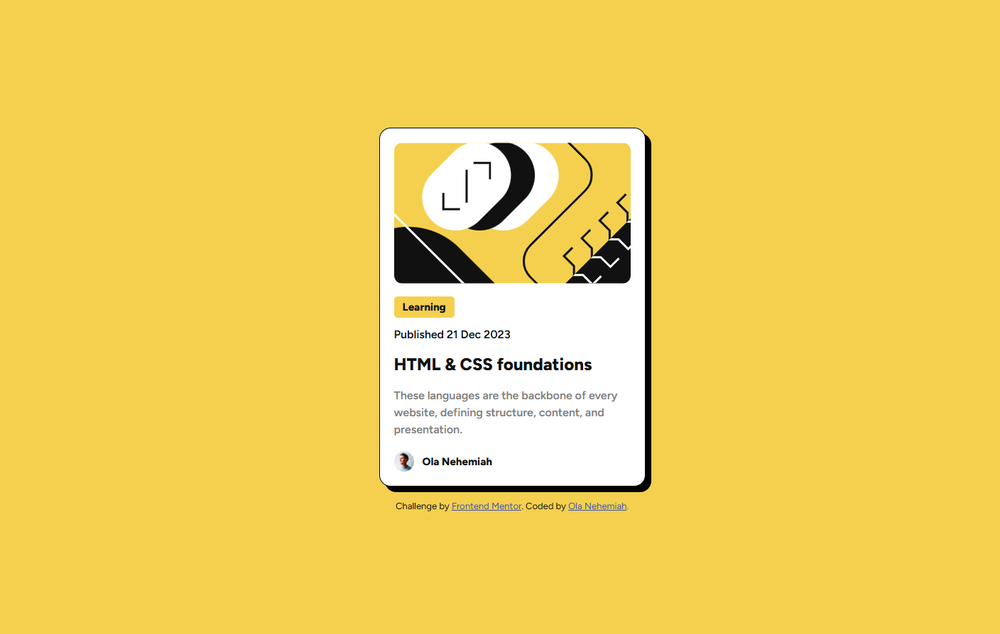

# Frontend Mentor - Blog preview card solution

## Table of contents
  - [Screenshot](#screenshot)
  - [Links](#links)
  - [Built with](#built-with)
  - [What I learned](#what-i-learned)
- [Author](#author)
- [Acknowledgments](#acknowledgments)

### Screenshot

### Links
- Solution URL: [Github solution](https://github.com/Nehhy01/Blog-Preview-Card.git)
- Live Site URL:(https://nehhy01.github.io/blog-Preview-Card)

## My process

### Built with

- Semantic HTML5 markup
- CSS custom properties
- Flexbox

### What I learned

This project was a simple one.
I learnt the difference between 
The main thing i learnt was interepreting a figma file for my development.
I extracted useful info like font size, spacing, color withoud depending on the /asset folder that came with this starter folder.
It was fun :)

## Author
- Frontend Mentor - [@nehhy01](https://www.frontendmentor.io/profile/nehhy01)
- GitHub - [Nehhy01] (https://github.com/Nehhy01)

## Acknowledgments

Thanks to Frontend Mentors for making this project available alongside its Figma Design.